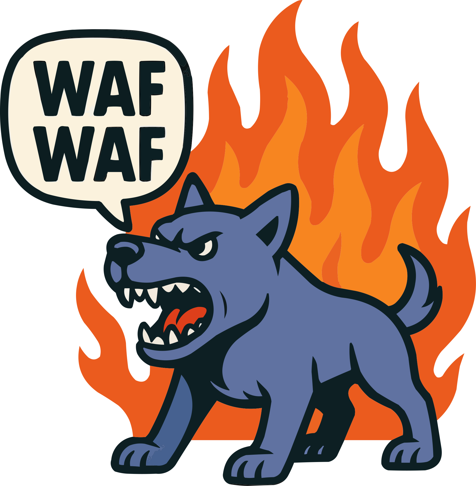

# Phirewall



**Protect your PHP application from brute force, DDoS, SQL injection, XSS, and bot attacks with a single middleware.**

Phirewall is a PSR-15 middleware that provides comprehensive application-layer protection. It's lightweight, framework-agnostic, and easy to configure.

---

## Why Phirewall?

- **Simple Setup** - Add protection in minutes with sensible defaults
- **Multiple Attack Vectors** - Rate limiting, brute force protection, OWASP rules, bot detection
- **Framework Agnostic** - Works with any PSR-15 compatible framework (Laravel, Symfony, Slim, Mezzio, etc.)
- **Production Ready** - Redis support for multi-server deployments
- **Observable** - PSR-14 events for logging, metrics, and alerting

## Quick Start

```bash
composer require flowd/phirewall
```

```php
use Flowd\Phirewall\Config;
use Flowd\Phirewall\Middleware;
use Flowd\Phirewall\KeyExtractors;
use Flowd\Phirewall\Store\InMemoryCache;

// Create the firewall
$config = new Config(new InMemoryCache());

// Allow health checks to bypass all rules
$config->safelists->add('health', fn($req) => $req->getUri()->getPath() === '/health');

// Block common scanner paths
$config->blocklists->add('scanners', fn($req) => str_starts_with($req->getUri()->getPath(), '/wp-admin'));

// Rate limit: 100 requests per minute per IP
$config->throttles->add('api', limit: 100, period: 60 /* seconds */, key: KeyExtractors::ip());

// Ban IP after 5 failed logins in 5 minutes
$config->fail2ban->add('login', threshold: 5, period: 300 /* seconds */, ban: 3600 /* seconds */,
    filter: fn($req) => $req->getHeaderLine('X-Login-Failed') === '1',
    key: KeyExtractors::ip()
);

// Add to your middleware stack
$middleware = new Middleware($config);
// The PSR-17 ResponseFactory is optional — Phirewall auto-detects installed factories.
// Pass one explicitly if needed: new Middleware($config, new Psr17Factory())
```

Add the middleware to your PSR-15 pipeline. All requests will be evaluated against your rules before reaching your application.

## Try It Now

Run one of the included examples to see Phirewall in action:

```bash
# Basic setup demo
php examples/01-basic-setup.php

# See brute force protection
php examples/02-brute-force-protection.php

# Test SQL injection blocking
php examples/04-sql-injection-blocking.php

# Full production setup
php examples/08-comprehensive-protection.php
```

## Examples

The [examples/](examples/) folder contains runnable examples:

| # | Example | Description |
|---|---------|-------------|
| 01 | [basic-setup](examples/01-basic-setup.php) | Minimal configuration to get started |
| 02 | [brute-force-protection](examples/02-brute-force-protection.php) | Fail2Ban-style login protection |
| 03 | [api-rate-limiting](examples/03-api-rate-limiting.php) | Tiered rate limits for APIs |
| 04 | [sql-injection-blocking](examples/04-sql-injection-blocking.php) | OWASP-style SQLi detection |
| 05 | [xss-prevention](examples/05-xss-prevention.php) | Cross-Site Scripting protection |
| 06 | [bot-detection](examples/06-bot-detection.php) | Scanner and malicious bot blocking |
| 07 | [ip-blocklist](examples/07-ip-blocklist.php) | File-backed IP/CIDR blocklists |
| 08 | [comprehensive-protection](examples/08-comprehensive-protection.php) | Production-ready multi-layer setup |
| 09 | [observability-monolog](examples/09-observability-monolog.php) | Event logging with Monolog |
| 10 | [observability-opentelemetry](examples/10-observability-opentelemetry.php) | Distributed tracing with OpenTelemetry |
| 11 | [redis-storage](examples/11-redis-storage.php) | Redis backend for multi-server deployments |
| 12 | [apache-htaccess](examples/12-apache-htaccess.php) | Apache .htaccess IP blocking |
| 13 | [benchmarks](examples/13-benchmarks.php) | Storage backend performance comparison |
| 14 | [owasp-crs-files](examples/14-owasp-crs-files.php) | Loading OWASP CRS rules from files |
| 15 | [in-memory-pattern-backend](examples/15-in-memory-pattern-backend.php) | Configuration-based CIDR/IP blocklists |
| 16 | [allow2ban](examples/16-allow2ban.php) | Hard volume cap with auto-ban |
| 17 | [known-scanners](examples/17-known-scanners.php) | Block known attack tools and vulnerability scanners |
| 18 | [trusted-bots](examples/18-trusted-bots.php) | Trusted bot verification via reverse DNS |
| 19 | [header-analysis](examples/19-header-analysis.php) | Suspicious headers detection |
| 20 | [rule-benchmarks](examples/20-rule-benchmarks.php) | Firewall rule performance benchmarks |
| 21 | [sliding-window](examples/21-sliding-window.php) | Sliding window rate limiting |
| 22 | [multi-throttle](examples/22-multi-throttle.php) | Multi-window burst + sustained rate limiting |
| 23 | [dynamic-limits](examples/23-dynamic-limits.php) | Role-based dynamic throttle limits |
| 24 | [pdo-storage](examples/24-pdo-storage.php) | PdoCache with SQLite, MySQL, PostgreSQL |
| 25 | [track-threshold](examples/25-track-threshold.php) | Track with optional threshold and thresholdReached flag |
| 26 | [psr17-factories](examples/26-psr17-factories.php) | PSR-17 response factory integration |
| 27 | [request-context](examples/27-request-context.php) | RequestContext API for post-handler fail2ban signaling |

## Features

### Protection Layers

| Feature | Description |
|---------|-------------|
| **Safelists** | Bypass all checks for trusted requests (health checks, internal IPs) |
| **Blocklists** | Immediately deny suspicious requests (403) |
| **Throttling** | Fixed and sliding window rate limiting by IP, user, API key, or custom key (429) with dynamic limits and multiThrottle |
| **Fail2Ban** | Auto-ban after repeated failures |
| **Allow2Ban** | Hard volume cap -- ban after too many total requests |
| **Track with Threshold** | Passive counting with optional alert threshold |
| **OWASP CRS** | SQL injection, XSS, and PHP injection detection |
| **Pattern Backends** | File/Redis-backed blocklists with IP, CIDR, path, and header patterns |

### Matchers

| Matcher | Description |
|---------|-------------|
| **Known Scanners** | Block sqlmap, nikto, nmap, and other scanner User-Agents |
| **Trusted Bots** | Safelist Googlebot, Bingbot, etc. via reverse DNS verification |
| **Suspicious Headers** | Block requests missing standard browser headers |
| **IP Matcher** | Safelist or block by IP/CIDR range |

### Observability

- **PSR-14 Events** - `SafelistMatched`, `BlocklistMatched`, `ThrottleExceeded`, `Fail2BanBanned`, `Allow2BanBanned`, `TrackHit`, `FirewallError`
- **Fail-Open by Default** - Cache outages don't take down the application; errors dispatched via PSR-14
- **Diagnostics Counters** - Per-rule statistics for monitoring
- **Standard Headers** - `X-RateLimit-*`, `Retry-After`, `X-Phirewall-*`

### Storage Backends

| Backend | Use Case |
|---------|----------|
| `InMemoryCache` | Development, testing, single requests |
| `ApcuCache` | Single-server production |
| `RedisCache` | Multi-server production |
| `PdoCache` | SQL-backed persistence (MySQL, PostgreSQL, SQLite) |

## Documentation

For detailed documentation, see the [docs/](docs/) folder:

- [Getting Started](docs/getting-started.md) - Step-by-step setup guide
- [Common Attacks](docs/common-attacks.md) - Protection recipes for 10+ attack types
- [Configuration](docs/configuration.md) - Complete API reference
- [Storage Backends](docs/storage-backends.md) - Redis, APCu, PDO, and custom backends
- [Pattern Backends](docs/pattern-backends.md) - IP, CIDR, path, and header blocklists
- [OWASP CRS](docs/owasp-crs.md) - Loading and customizing rules
- [Observability](docs/observability.md) - Events, logging, and monitoring
- [Infrastructure Adapters](docs/infrastructure-adapters.md) - Apache .htaccess integration

## Installation

```bash
composer require flowd/phirewall
```

### Optional Dependencies

```bash
# For Redis-backed distributed counters (multi-server)
composer require predis/predis

# For Monolog logging integration
composer require monolog/monolog
```

**APCu**: Enable the PHP extension and set `apc.enable_cli=1` for CLI testing.

## Response Headers

When a request is blocked:

| Header | Description |
|--------|-------------|
| `X-Phirewall` | Block type: `blocklist`, `throttle`, `fail2ban`, `allow2ban` |
| `X-Phirewall-Matched` | Rule name that triggered |
| `Retry-After` | Seconds until rate limit resets (429 only) |

Enable `$config->enableRateLimitHeaders()` for standard `X-RateLimit-*` headers.

## Client IP Behind Proxies

When behind load balancers or CDNs, use `TrustedProxyResolver`:

```php
use Flowd\Phirewall\Http\TrustedProxyResolver;
use Flowd\Phirewall\KeyExtractors;

$resolver = new TrustedProxyResolver([
    '10.0.0.0/8',      // Internal network
    '172.16.0.0/12',   // Docker
]);

$config->throttles->add('api', limit: 100, period: 60,
    key: KeyExtractors::clientIp($resolver)
);
```

## Custom Responses

Customize blocked responses while keeping standard headers:

```php
use Flowd\Phirewall\Config\Response\ClosureBlocklistedResponseFactory;
use Flowd\Phirewall\Config\Response\ClosureThrottledResponseFactory;

$config->blocklistedResponseFactory = new ClosureBlocklistedResponseFactory(
    function (string $rule, string $type, $req) {
        return new Response(403, ['Content-Type' => 'application/json'],
            json_encode(['error' => 'Blocked', 'rule' => $rule])
        );
    }
);

$config->throttledResponseFactory = new ClosureThrottledResponseFactory(
    function (string $rule, int $retryAfter, $req) {
        return new Response(429, ['Content-Type' => 'application/json'],
            json_encode(['error' => 'Rate limited', 'retry_after' => $retryAfter])
        );
    }
);
```

### PSR-17 Response Factories

Use standard PSR-17 factories for framework-native responses:

```php
use Nyholm\Psr7\Factory\Psr17Factory;

$psr17 = new Psr17Factory();
$config->usePsr17Responses($psr17, $psr17);
```

Or customise body text per response type:

```php
use Flowd\Phirewall\Config\Response\Psr17BlocklistedResponseFactory;
use Flowd\Phirewall\Config\Response\Psr17ThrottledResponseFactory;

$config->blocklistedResponseFactory = new Psr17BlocklistedResponseFactory(
    $psr17, $psr17, 'Access Denied',
);
$config->throttledResponseFactory = new Psr17ThrottledResponseFactory(
    $psr17, $psr17, 'Rate limit exceeded.',
);
```

## OWASP Core Rule Set

Load OWASP-style rules for SQL injection, XSS, and more:

```php
use Flowd\Phirewall\Owasp\SecRuleLoader;

$rules = SecRuleLoader::fromString(<<<'CRS'
SecRule ARGS "@rx (?i)\bunion\b.*\bselect\b" "id:942100,phase:2,deny,msg:'SQLi'"
SecRule ARGS "@rx (?i)<script[^>]*>" "id:941100,phase:2,deny,msg:'XSS'"
CRS);

$config->blocklists->owasp('owasp', $rules);
```

Or load from files:

```php
$rules = \Flowd\Phirewall\Owasp\SecRuleLoader::fromDirectory('/path/to/crs-rules');
```

See [04-sql-injection-blocking.php](examples/04-sql-injection-blocking.php) and [05-xss-prevention.php](examples/05-xss-prevention.php) for complete examples.

## Real-World Recipes

### API Rate Limiting

```php
use Flowd\Phirewall\KeyExtractors;

// Global limit
$config->throttles->add('global', limit: 1000, period: 60, key: KeyExtractors::ip());

// Burst + sustained rate limiting with multiThrottle
$config->throttles->multi('api', [
    1  => 5,     // 5 req/s burst
    60 => 200,   // 200 req/min sustained
], KeyExtractors::ip());

// Dynamic limits based on user role
$config->throttles->add('user', fn($req) => $req->getHeaderLine('X-Plan') === 'pro' ? 5000 : 100, 60,
    KeyExtractors::header('X-User-Id')
);
```

### Login Protection

```php
use Flowd\Phirewall\KeyExtractors;

// Throttle login attempts
$config->throttles->add('login', limit: 10, period: 60, key: function($req) {
    return $req->getUri()->getPath() === '/login'
        ? $req->getServerParams()['REMOTE_ADDR']
        : null;
});

// Ban after failures — signaled via RequestContext from your handler
$config->fail2ban->add('login-ban', threshold: 5, period: 300, ban: 3600,
    filter: fn($request): bool => false,
    key: KeyExtractors::ip()
);
```

In your login handler, signal failures via the request context:

```php
use Flowd\Phirewall\Context\RequestContext;

$context = $request->getAttribute(RequestContext::ATTRIBUTE_NAME);
if (!$authenticated && $context instanceof RequestContext) {
    $context->recordFailure('login-ban', $request->getServerParams()['REMOTE_ADDR'] ?? '');
}
```

### Bot Detection

```php
$scanners = ['sqlmap', 'nikto', 'nmap', 'burp', 'dirbuster'];

$config->blocklists->add('scanners', function($req) use ($scanners) {
    $ua = strtolower($req->getHeaderLine('User-Agent'));
    foreach ($scanners as $scanner) {
        if (str_contains($ua, $scanner)) return true;
    }
    return false;
});
```

## Development

```bash
# Run tests
composer test

# Run PdoCache tests against SQLite, MySQL, and PostgreSQL (requires Docker)
composer test:database
# Or directly: ./bin/test-databases.sh --keep  (keeps containers running)

# Run performance benchmarks only (no coverage, Xdebug disabled)
XDEBUG_MODE=off PHIREWALL_RUN_BENCHMARKS=1 vendor/bin/phpunit --group performance --no-coverage

# Fix code style
composer fix

# Mutation testing
composer test:mutation
```

## Sponsors

This project received funding from TYPO3 Association through its Community Budget program.

[Read more](https://typo3.org/article/members-have-selected-four-ideas-to-be-funded-in-quarter-4-2025)

## License

Dual licensed under LGPL-3.0-or-later and proprietary. See [LICENSE](LICENSE) for details.
